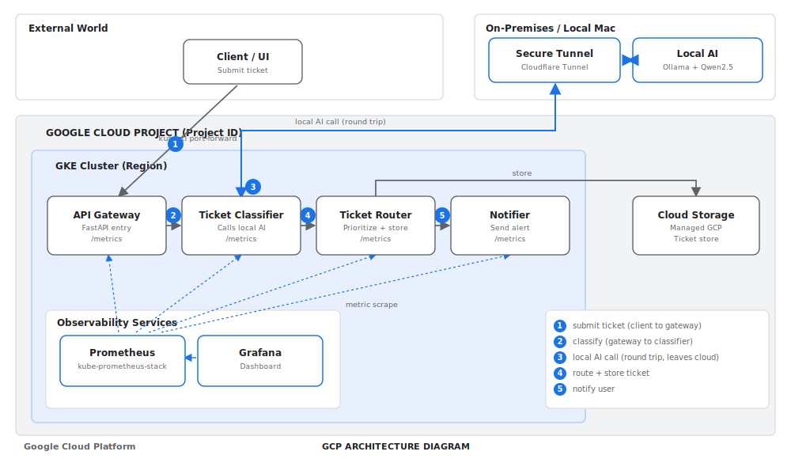
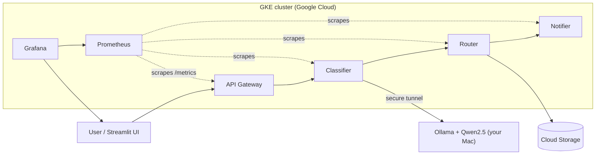

# AI Ticket Triage on Kubernetes, with the AI running on your own machine

An AI support ticket triage system where the **AI model runs on your own computer** and **Kubernetes in the cloud does all the processing around it**. The cloud orchestrates; your laptop does the thinking. The result: a real microservices system on Google Kubernetes Engine with **zero cost for the AI**, because the model never leaves your machine.

The **same codebase runs on both Google Cloud (GKE) and AWS (EKS)**. Only the managed services and provisioning commands change, never the application code. The AWS path is in [docs/MIGRATION-TO-AWS.md](docs/MIGRATION-TO-AWS.md).

---

## The idea

Running AI models in the cloud usually means paying per token to a hosted API. This project flips that around: an open model (Qwen2.5) runs locally through Ollama, and the cloud cluster reaches it over a secure tunnel. You get the scalability and observability of Kubernetes, while the intelligence stays on your own hardware. That keeps the AI free and lets sensitive data stay local.

---

## Architecture





**How a ticket flows:** the user submits a ticket to the API Gateway. The Classifier sends the text across the tunnel to the local model, which returns a category and urgency. The Router assigns a priority and saves the ticket to Cloud Storage, then triggers the Notifier. Prometheus scrapes every service and Grafana shows it all live.

---

## Tech stack

| Layer | Technology |
|---|---|
| Orchestration | Google Kubernetes Engine (GKE) |
| Services | Python, FastAPI (api-gateway, classifier, router, notifier) |
| AI model | Qwen2.5 via Ollama, running locally |
| Cloud-to-local bridge | Cloudflare Tunnel |
| Storage | Google Cloud Storage |
| Identity | Workload Identity |
| Images | Artifact Registry |
| Observability | Prometheus + Grafana (kube-prometheus-stack) |
| UI | Streamlit |

---

## Repository structure

```
services/      four FastAPI microservices (each with a Dockerfile)
k8s/           Kubernetes manifests (portable to EKS)
ui/            Streamlit front end
scripts/       helper scripts (setup, deploy, tunnel, cleanup)
observability/ Grafana dashboard JSON
docs/          architecture, runbook, migration guide, images
```

---

## Prerequisites

- A Google Cloud account with billing or free trial credits
- On your Mac: `ollama` (with `qwen2.5:7b` pulled) and `cloudflared`
- `gcloud`, `kubectl`, `helm` (the GCP steps below can also be done in Cloud Shell, which has all three)

Set these once and reuse them:

```bash
export PROJECT_ID=your-project-id
export REGION=asia-south1
export ZONE=asia-south1-a
```

---

## Deployment guide (everything, start to finish)

### 1. Run the AI locally and expose it

On your Mac, in two terminals:

```bash
# terminal 1: the model server
ollama serve
ollama pull qwen2.5:7b

# terminal 2: a public tunnel to it
# the host-header flag is REQUIRED, or Ollama rejects tunneled requests with 403
cloudflared tunnel --url http://localhost:11434 --http-host-header localhost:11434
```

Copy the printed `https://<random>.trycloudflare.com` URL. Keep both terminals open, and keep the Mac awake (`caffeinate -dimsu` in another tab).

### 2. Create the GCP foundations

```bash
gcloud config set project "$PROJECT_ID"
gcloud services enable container.googleapis.com artifactregistry.googleapis.com storage.googleapis.com

# image registry
gcloud artifacts repositories create triage --repository-format=docker --location="$REGION"

# bucket for tickets
gcloud storage buckets create "gs://${PROJECT_ID}-tickets-poc" --location="$REGION"
```

### 3. Create the GKE cluster

A small, cost-minimal Standard cluster. **Enable Workload Identity at creation** (it defaults off on Standard clusters via the console):

```bash
gcloud container clusters create triage-poc \
  --zone "$ZONE" --num-nodes 2 --machine-type e2-medium --spot \
  --workload-pool="${PROJECT_ID}.svc.id.goog"

gcloud container clusters get-credentials triage-poc --zone "$ZONE"
```

### 4. Set up permissions (Workload Identity)

So the router can write to Cloud Storage without any key file:

```bash
gcloud iam service-accounts create triage-poc

gcloud projects add-iam-policy-binding "$PROJECT_ID" \
  --member="serviceAccount:triage-poc@${PROJECT_ID}.iam.gserviceaccount.com" \
  --role="roles/storage.objectAdmin"

gcloud iam service-accounts add-iam-policy-binding \
  "triage-poc@${PROJECT_ID}.iam.gserviceaccount.com" \
  --role roles/iam.workloadIdentityUser \
  --member "serviceAccount:${PROJECT_ID}.svc.id.goog[triage/triage-sa]"

# the GKE node service account also needs to pull images
PNUM=$(gcloud projects describe "$PROJECT_ID" --format="value(projectNumber)")
gcloud projects add-iam-policy-binding "$PROJECT_ID" \
  --member="serviceAccount:${PNUM}-compute@developer.gserviceaccount.com" \
  --role="roles/artifactregistry.reader"
```

### 5. Build and push the images

```bash
REG="${REGION}-docker.pkg.dev/${PROJECT_ID}/triage"
gcloud auth configure-docker "${REGION}-docker.pkg.dev"

for svc in api-gateway classifier router notifier; do
  docker build -t "$REG/$svc:latest" services/$svc
  docker push "$REG/$svc:latest"
done
```

### 6. Deploy to the cluster

```bash
# fill the placeholders in the manifests
sed -i "s|REGISTRY_PLACEHOLDER|$REG|g; s|PROJECT_ID|$PROJECT_ID|g" k8s/*.yaml

kubectl apply -f k8s/00-namespace-config.yaml
kubectl apply -f k8s/10-api-gateway.yaml -f k8s/11-classifier.yaml \
              -f k8s/12-router.yaml -f k8s/13-notifier.yaml -f k8s/21-hpa.yaml

# point the classifier at your local model (use your live tunnel URL)
kubectl -n triage create secret generic triage-secrets \
  --from-literal=OLLAMA_BASE_URL=https://<your-tunnel>.trycloudflare.com

kubectl -n triage get pods -w   # wait for all four to be Running
```

### 7. Add observability

```bash
helm repo add prometheus-community https://prometheus-community.github.io/helm-charts
helm repo update
helm install kube-prometheus-stack prometheus-community/kube-prometheus-stack \
  --namespace monitoring --create-namespace

kubectl apply -f k8s/30-servicemonitor.yaml
```

Open Grafana, log in (`admin` + the password below), and import `observability/grafana-dashboard.json`.

```bash
kubectl -n monitoring port-forward svc/kube-prometheus-stack-grafana 3000:80
kubectl -n monitoring get secret kube-prometheus-stack-grafana \
  -o jsonpath='{.data.admin-password}' | base64 -d ; echo
```

### 8. Use it

```bash
kubectl -n triage port-forward svc/api-gateway 8000:8000 &

# command line
curl -X POST http://localhost:8000/tickets -H "Content-Type: application/json" \
  -d '{"subject":"Cannot log in","body":"Password error blocking my team, urgent."}'

# or the UI
cd ui && pip install -r requirements.txt
API_URL=http://localhost:8000 streamlit run streamlit_app.py
```

---

## Cost

With Google Cloud free trial credits this is effectively free. At normal prices it is roughly a dollar or two per day, driven almost entirely by the worker nodes. The cluster management fee is covered by GKE's free tier (one zonal cluster), and the AI costs nothing because it runs locally. **Delete the cluster when you finish** so nothing keeps billing.

---

## Lessons learned (the parts the tutorials skip)

- **Workload Identity defaults to off** on console-created Standard clusters. Enable it at creation, or you will hit "Identity Pool does not exist" later.
- **Nodes need `roles/artifactregistry.reader`** or image pulls fail with 403.
- **Container file permissions matter.** A non-root container can fail to read its own app files if they were copied with restrictive permissions; set readable permissions in the Dockerfile.
- **One small node is not enough** for the app plus the monitoring stack. Two e2-medium nodes gave enough room.
- **Ollama rejects tunneled requests** unless you pass `--http-host-header localhost:11434`.
- **Grafana via a proxy** needs its root URL and trusted origins set, or queries fail with "origin not allowed."
- **kube-prometheus-stack Grafana storage is ephemeral** by default; created dashboards vanish on a pod restart. Enable persistence for anything you want to keep.

---

## Migrating to AWS

The same workload runs on AWS with the **same codebase**. Kubernetes is cloud agnostic, and the only cloud-specific code sits behind one storage interface (`services/router/storage.py`, which already includes S3 and DynamoDB backends).

**Stays identical:** all four service code bases, the container images, the Kubernetes manifests (except the image path), the local Ollama AI and tunnel, and the Prometheus and Grafana dashboards.

**Changes (config and tooling only):** GKE to EKS, Artifact Registry to ECR, Cloud Storage to S3, Workload Identity to IRSA, and `gcloud` to `eksctl` and the `aws` CLI.

Full reference also in [docs/MIGRATION-TO-AWS.md](docs/MIGRATION-TO-AWS.md).

### AWS deployment, step by step

Cost note: EKS charges about $0.10 per hour per cluster (no free-tier waiver), plus EC2 nodes. Delete the cluster when done. All steps run in AWS CloudShell (the browser terminal). Your Mac side (Ollama + Cloudflare tunnel) is unchanged.

**0. Open CloudShell and get the code**

```bash
# install eksctl/helm if missing
eksctl version || { curl -sSL "https://github.com/eksctl-io/eksctl/releases/latest/download/eksctl_Linux_amd64.tar.gz" | tar xz -C /tmp && sudo mv /tmp/eksctl /usr/local/bin; }
helm version  || curl -fsSL https://raw.githubusercontent.com/helm/helm/main/scripts/get-helm-3 | bash

git clone https://github.com/Cetyl/gke-ai-ticket-triage.git
cd gke-ai-ticket-triage

export REGION=ap-south-1
export ACCOUNT_ID=$(aws sts get-caller-identity --query Account --output text)
export BUCKET=${ACCOUNT_ID}-triage-poc
export ECR=${ACCOUNT_ID}.dkr.ecr.${REGION}.amazonaws.com
```

**1. Keep the local AI running** (on your Mac, same as GCP):

```bash
ollama serve
cloudflared tunnel --url http://localhost:11434 --http-host-header localhost:11434
```

**2. Build and push images to ECR**

```bash
aws ecr get-login-password --region $REGION | docker login --username AWS --password-stdin $ECR
for svc in api-gateway classifier router notifier; do
  aws ecr create-repository --repository-name triage/$svc --region $REGION 2>/dev/null || true
  docker build -t $ECR/triage/$svc:latest services/$svc
  docker push $ECR/triage/$svc:latest
done
```

**3. Create the S3 bucket**

```bash
aws s3 mb s3://$BUCKET --region $REGION
```

**4. Create the EKS cluster** (15 to 20 minutes)

```bash
eksctl create cluster --name triage-poc --region $REGION \
  --managed --spot --instance-types t3.medium --nodes 2 --with-oidc
kubectl get nodes
```

**5. Pod identity (IRSA) for S3**

```bash
kubectl create namespace triage

cat > /tmp/triage-s3.json <<EOF
{ "Version":"2012-10-17","Statement":[{"Effect":"Allow",
  "Action":["s3:GetObject","s3:PutObject","s3:ListBucket"],
  "Resource":["arn:aws:s3:::${BUCKET}","arn:aws:s3:::${BUCKET}/*"]}]}
EOF
aws iam create-policy --policy-name triage-s3 --policy-document file:///tmp/triage-s3.json

eksctl create iamserviceaccount --cluster triage-poc --region $REGION \
  --namespace triage --name triage-sa \
  --attach-policy-arn arn:aws:iam::${ACCOUNT_ID}:policy/triage-s3 --approve
```

**6. Adjust config and deploy.** Point images at ECR, set the storage backend to S3, and remove the GCP service-account block from `k8s/00-namespace-config.yaml` (eksctl owns `triage-sa` now). In that ConfigMap set `STORAGE_BACKEND: "s3"` and add `S3_BUCKET: "<your bucket>"`.

```bash
sed -i "s|REGISTRY_PLACEHOLDER|$ECR/triage|g" k8s/10-*.yaml k8s/11-*.yaml k8s/12-*.yaml k8s/13-*.yaml

kubectl apply -f k8s/00-namespace-config.yaml   # namespace + configmap (SA block removed)
kubectl apply -f k8s/10-api-gateway.yaml -f k8s/11-classifier.yaml \
              -f k8s/12-router.yaml -f k8s/13-notifier.yaml -f k8s/21-hpa.yaml

kubectl -n triage create secret generic triage-secrets \
  --from-literal=OLLAMA_BASE_URL=https://<your-tunnel>.trycloudflare.com

kubectl -n triage get pods -w
```

**7. Observability** (identical to GCP)

```bash
helm repo add prometheus-community https://prometheus-community.github.io/helm-charts
helm repo update
helm install kube-prometheus-stack prometheus-community/kube-prometheus-stack \
  --namespace monitoring --create-namespace
kubectl apply -f k8s/30-servicemonitor.yaml
```

**8. Test**

```bash
kubectl -n triage port-forward svc/api-gateway 8000:8000 &
curl -X POST http://localhost:8000/tickets -H "Content-Type: application/json" \
  -d '{"subject":"Payment failed","body":"Charged twice, urgent refund needed."}'
aws s3 ls s3://$BUCKET/tickets/
```

**9. Cleanup** (EKS is not free, do not skip)

```bash
eksctl delete cluster --name triage-poc --region $REGION
aws s3 rb s3://$BUCKET --force
```

---

## Cleanup

```bash
gcloud container clusters delete triage-poc --zone "$ZONE"
gcloud storage rm -r "gs://${PROJECT_ID}-tickets-poc"
# on your Mac: stop the tunnel, and run: pkill ollama ; pkill caffeinate
```

---

## License

MIT
